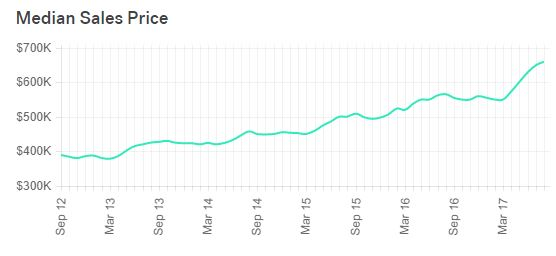

```{r setup, include=FALSE}
knitr::opts_chunk$set(echo = TRUE)

train <- read.csv("train.csv")
test <- read.csv("test.csv")

# finding the dimension of our datasets
dim(train) 
dim(test)

# create a data frame that returns the number of NA values in each column
train_na <- data.frame(column = c(-1), is_na = c(-1))
for (i in c(1:79)){ 
  train_na <- rbind(train_na, c(i, sum(is.na(train[, i])))) 
}
train_na <- train_na[c(-1), ]

# print the names of the factors with NA values
# The only factors that have NA values are columns 4, 7, 26, 27, 31, 32, 33, 34, 36, 43, 58, 59, 60, 61, 64, 65, 73, 74, 75
for (i in c(4, 7, 26, 27, 31, 32, 33, 34, 36, 43, 58, 59, 60, 61, 64, 65, 73, 74, 75)){ 
  print(c(i, names(train)[i]))
}
```

# Project Description

The Seattle housing market is one of the hottest housing markets in the United States. The median house price for houses sold in Seattle has been steadily increasing over the years. From data obtained from Trulia, the Median Housing price increased from \$450,000 (September 2014) to $660,000 (August 2017) [@trulia]. Figure 1, shows their is a increasing trend of the Seattle median sales price for the past 5 years and a giant jump for the past year. Our project was motivated by how competitve the Seattle housing market is and we want to get a better understanding of how the characteristics of properties affect the price. To accomplish this goal, we chose to analyze data obtained for properties sold in Ames, Iowa. 



This project is focused on answering questions from the aspect a of first-time buyer and seller. By analyzing how the characteristics of a property (number of rooms, square footage, etc.) affect the selling price, we can provide easy to understand results that allow first-time buyers and sellers confidently enter the housing market.

# Data Description and Exploration
Based off the Boston Housing Data Set created by Harrison and Rubinfeld (1978), Dean De Cock sorted through data collected by the Ames City Assessor’s Office of Ames, Iowa. Cock’s final dataset contains details of the 2,930 residential properties sold in Ames between the years of 2006 and 2010. Each observation represents a unique home; homes which were resold within the four year time period were only recorded once. Moreover, each observation contains roughly 23 nominal variables, 23 ordinal variables, 14 discrete variables, and 20 continuous variables. In general, the continuous variables represent the dimension of an aspect of the house, such as the square feet of the first floor; the discrete variables quantify the amount of a particular aspect of the house, such as the number bedrooms; the ordinal variables rate aspects of the house, such as the height of the basement; and the nominal variables identify the types of aspects of the house, such as the type of foundation. Every variable was chosen from the raw data with the idea that it "could be easily understood by users at all levels," which meant that 34 variables had to be left out [@cock]. Finally, there are NA values in the dataset when appropriate. For instance, not every house has a rating for the quality of the fireplace since not every house has a fireplace.


Our group discovered this dataset on Kaggle.com as part of a competition which ended on March 1st of 2017. The submissions of this competition ``are evaluated on Root-Mean-Squared Error (RMSE) between the  logarithm of the predicted value and the logarithm of the observed sales price." Two datasets are provided: the training dataset has 1460 observations and the testing dataset has 1459 observations. The public leaderboard shows the least RMSE to be 0.06628.

(Data exploration has not been included.)

# Project Objectives and Questions
Our project objectives are to address the following questions. 

1. Which predictors are the most important in predicting the price of a home? 

We plan on using linear regression, LASSO, and PCA for dimension reduction as well as possibly exploring other feature selection techniques if needed. 

2. Do different neighborhoods affect housing prices? 

We assume the answer to this question is "Yes", and we plan to discover how. We can use linear regression to identify the important how the different neighborhoods affect the housing prices as well as a preform a spacial cluster analysis on the data. 

3. Are there significant temporal trends? 

We suspect that there will be interesting temporal trends since this dataset includes information from 2006 until 2010, i.e., it contains information about housing prices before, during, and after the housing bubble. We are interested in discovering whether there will be major differences between home price prediction models restricted to certain years, and we aim to explain these possible differences by events which occurred in each of those years. 

4. Can we produce one relatively accurate price prediction model? 

We will use a variety of techniques including linear regression, random forests, and cluster analysis to take into consideration the location of the home as well as temporal trends. We will take the previous responses into consideration when creating our final model. 

5. How accurate is our prediction model when used to predict the prices of 1-story homes versus 2-story homes?

We will restrict our dataset to only 1-story/2-story homes and test our model using linear regression. 


# External Sources pertaining to the Dataset
Data Documentation 

http://www.amstat.org/publications/jse/v19n3/decock/DataDocumentation.txt

Kaggle Competition
House Prices: Advanced Regression Techniques

https://www.kaggle.com/c/house-prices-advanced-regression-techniques

Data 

http://www.amstat.org/publications/jse/v19n3/decock/AmesHousing.xls

Map of residential assessment neighborhoods

https://ww2.amstat.org/publications/jse/v19n3/decock/AmesResidential.pdf


# Requirements for the proposal
Just to keep in mind, these are the requirements for the proposal

- 2 pages long 

- project description 

- How and where you obtained the data 

- Questions you may want to address using the data and corresponding data minig & statistical learning methods

---
references:
- id: trulia
  title: Real Estate Data for Seattle
  author: Trulia
  URL: 'https://www.trulia.com/real_estate/Seattle-Washington/market-trends/'

- id: cock 
  title: Ames, Iowa: Alternative to the Boston Housing Data as an End of Semester Regression Project
  author: Dean De Cock
  URL: https://ww2.amstat.org/publications/jse/v19n3/decock.pdf
---