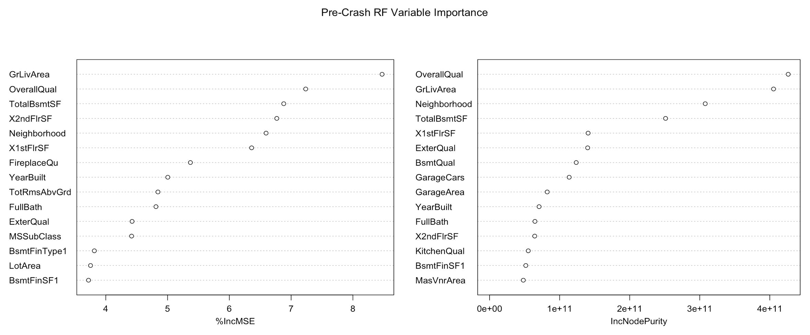
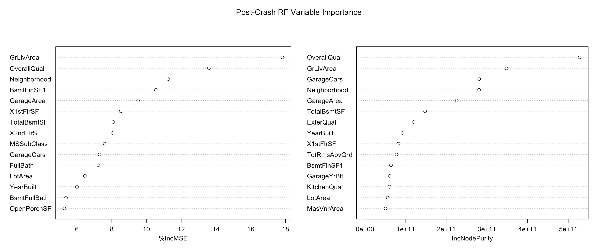
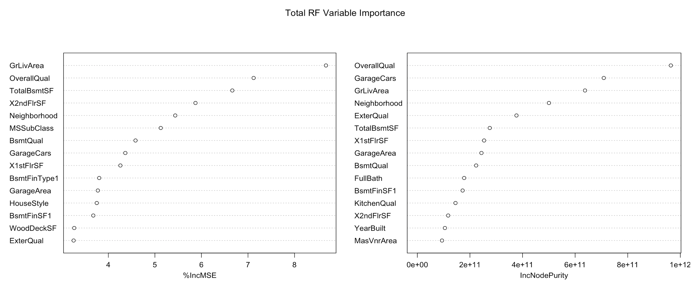

## Complete Buyer Data Models 
### Pre-crash Models: Linear Regression
We begun by conducting a complete analysis on all the predictors in order to identify the importance of each predictor in determining the price of the house. The result of this analysis will give insight into the weight of each predictor to first time home buyers. Having this information will allow first time home buyers the ability to analyze what is important to them as well as how important certain features are. 

Our first model is a linear regression model with the entire training dataset of homes sold within the years 2006 and 2007. We begun this analysis by removing sparse variables such as Ultitilies (All public ultities: 558; Electricity and Gas Only: 0) and Street (Paved: 588; Gravel:0). We then created a correlation plot to discover which (if any) variables were correlated enough to negatively impact our linear regression model. We saw evidence of high correlations between some variables, but only chose to remove the year the garage was built, which was highly correlated with the year the house was built. A Box Cox transformation of our linear regression model urged us to consider $log$(SalePrice) instead of SalePrice as our outcome variable, which we did. Finally, we began to apply linear regression models to the dataset, removing highly correlated factors along the way. Below are the results of our final model. 

```{r, include = FALSE}
library(dplyr)
library(randomForest)
library(corrplot)
library(MASS)
library(car)
library(caret)
library(tidyr)

setwd("/Users/vdiaz/Desktop/Victoria/")

train <- read.csv("train.csv")

# finding the dimension of our datasets
dim(train) 

#Data cleaning for train
train$Alley <- as.character(train$Alley)
train$Alley[is.na(train$Alley)] <- "none"
train$Alley <- as.factor(train$Alley)

train$MasVnrType <- as.character(train$MasVnrType)
train$MasVnrType[is.na(train$MasVnrType)] <- "none"
train$MasVnrType <- as.factor(train$MasVnrType)

train$MasVnrArea[is.na(train$MasVnrArea)] <- 0

train$BsmtQual <- as.character(train$BsmtQual)
train$BsmtQual[is.na(train$BsmtQual)] <- "none"
train$BsmtQual <- as.factor(train$BsmtQual)

train$BsmtCond <- as.character(train$BsmtCond)
train$BsmtCond[is.na(train$BsmtCond)] <- "none"
train$BsmtCond <- as.factor(train$BsmtCond)

train$BsmtExposure <- as.character(train$BsmtExposure)
train$BsmtExposure[is.na(train$BsmtExposure)] <- "none"
train$BsmtExposure <- as.factor(train$BsmtExposure)

train$BsmtFinType1 <- as.character(train$BsmtFinType1)
train$BsmtFinType1[is.na(train$BsmtFinType1)] <- "none"
train$BsmtFinType1 <- as.factor(train$BsmtFinType1)

train$BsmtFinType2 <- as.character(train$BsmtFinType2)
train$BsmtFinType2[is.na(train$BsmtFinType2)] <- "none"
train$BsmtFinType2 <- as.factor(train$BsmtFinType2)

train$FireplaceQu <- as.character(train$FireplaceQu)
train$FireplaceQu[is.na(train$FireplaceQu)] <- "none"
train$FireplaceQu <- as.factor(train$FireplaceQu)

train$GarageType <- as.character(train$GarageType)
train$GarageType[is.na(train$GarageType)] <- "none"
train$GarageType <- as.factor(train$GarageType)

train$GarageFinish <- as.character(train$GarageFinish)
train$GarageFinish[is.na(train$GarageFinish)] <- "none"
train$GarageFinish <- as.factor(train$GarageFinish)

train$GarageQual <- as.character(train$GarageQual)
train$GarageQual[is.na(train$GarageQual)] <- "none"
train$GarageQual <- as.factor(train$GarageQual)

train$GarageCond <- as.character(train$GarageCond)
train$GarageCond[is.na(train$GarageCond)] <- "none"
train$GarageCond <- as.factor(train$GarageCond)

train$PoolQC <- as.character(train$PoolQC)
train$PoolQC[is.na(train$PoolQC)] <- "none"
train$PoolQC <- as.factor(train$PoolQC)

train$Fence <- as.character(train$Fence)
train$Fence[is.na(train$Fence)] <- "none"
train$Fence <- as.factor(train$Fence)

train$MiscFeature <- as.character(train$MiscFeature)
train$MiscFeature[is.na(train$MiscFeature)] <- "none"
train$MiscFeature <- as.factor(train$MiscFeature)

train$LotFrontage[is.na(train$LotFrontage)] <- 0

train <- train %>% filter(!is.na(Electrical) & !is.na(GarageYrBlt))

#Removing rare factors
train <- train %>% group_by(MSSubClass) %>% filter(n() >= 6) %>% 
  group_by(MSZoning) %>% filter(n() >= 6) %>%
  group_by(Alley) %>% filter(n() >= 6) %>%
  group_by(LotShape) %>% filter(n() >= 6) %>%
  group_by(LandContour) %>% filter(n() >= 6) %>%
  group_by(LotConfig) %>% filter(n() >= 6) %>%
  group_by(Neighborhood) %>% filter(n() >= 6) %>%
  group_by(Condition1) %>% filter(n() >= 6) %>%
  group_by(Condition2) %>% filter(n() >= 6) %>%
  group_by(BldgType) %>% filter(n() >= 6) %>%
  group_by(HouseStyle) %>% filter(n() >= 6) %>%
  group_by(OverallQual) %>% filter(n() >= 6) %>%
  group_by(OverallCond) %>% filter(n() >= 6) %>%
  group_by(RoofStyle) %>% filter(n() >= 6) %>%
  group_by(RoofMatl) %>% filter(n() >= 6) %>%
  group_by(Exterior1st) %>% filter(n() >= 6) %>%
  group_by(Exterior2nd) %>% filter(n() >= 6) %>%
  group_by(MasVnrType) %>% filter(n() >= 6) %>%
  group_by(ExterQual) %>% filter(n() >= 6) %>%
  group_by(ExterCond) %>% filter(n() >= 6) %>%
  group_by(Foundation) %>% filter(n() >= 6) %>%
  group_by(BsmtQual) %>% filter(n() >= 6) %>%
  group_by(BsmtCond) %>% filter(n() >= 6) %>%
  group_by(BsmtExposure) %>% filter(n() >= 6) %>%
  group_by(BsmtFinType1) %>% filter(n() >= 6) %>%
  group_by(BsmtFinType2) %>% filter(n() >= 6) %>%
  group_by(Heating) %>% filter(n() >= 6) %>%
  group_by(HeatingQC) %>% filter(n() >= 6) %>%
  group_by(CentralAir) %>% filter(n() >= 6) %>%
  group_by(KitchenQual) %>% filter(n() >= 6) %>%
  group_by(Functional) %>% filter(n() >= 6) %>%
  group_by(FireplaceQu) %>% filter(n() >= 6) %>%
  group_by(GarageType) %>% filter(n() >= 6) %>%
  group_by(GarageFinish) %>% filter(n() >= 6) %>%
  group_by(GarageQual) %>% filter(n() >= 6) %>%
  group_by(GarageCond) %>% filter(n() >= 6) %>%
  group_by(PavedDrive) %>% filter(n() >= 6) %>%
  group_by(PoolQC) %>% filter(n() >= 6) %>%
  group_by(Fence) %>% filter(n() >= 6) %>%
  group_by(SaleType) %>% filter(n() >= 6) %>%
  group_by(SaleCondition) %>% filter(n() >= 6)


train$MSSubClass <- factor(train$MSSubClass) 
train$MSZoning <- factor(train$MSZoning)
train$Alley <- factor(train$Alley)
train$LotShape <- factor(train$LotShape)
train$LandContour <- factor(train$LandContour)
train$LotConfig <- factor(train$LotConfig)
train$Neighborhood <- factor(train$Neighborhood)
train$Condition1 <- factor(train$Condition1)
train$Condition2 <- factor(train$Condition2)
train$BldgType <- factor(train$BldgType)
train$HouseStyle <- factor(train$HouseStyle)
train$OverallQual <- factor(train$OverallQual)
train$OverallCond <- factor(train$OverallCond)
train$RoofStyle <- factor(train$RoofStyle)
train$RoofMatl <- factor(train$RoofMatl)
train$Exterior1st <- factor(train$Exterior1st)
train$Exterior2nd <- factor(train$Exterior2nd)
train$MasVnrType <- factor(train$MasVnrType)
train$ExterQual <- factor(train$ExterQual)
train$ExterCond <- factor(train$ExterCond)
train$Foundation <- factor(train$Foundation)
train$BsmtQual <- factor(train$BsmtQual)
train$BsmtCond <- factor(train$BsmtCond)
train$BsmtExposure <- factor(train$BsmtExposure)
train$BsmtFinType1 <- factor(train$BsmtFinType1)
train$BsmtFinType2 <- factor(train$BsmtFinType2)
train$Heating <- factor(train$Heating)
train$HeatingQC <- factor(train$HeatingQC)
train$CentralAir <- factor(train$CentralAir)
train$KitchenQual <- factor(train$KitchenQual)
train$Functional <- factor(train$Functional)
train$FireplaceQu <- factor(train$FireplaceQu)
train$GarageType <- factor(train$GarageType)
train$GarageFinish <- factor(train$GarageFinish)
train$GarageQual <- factor(train$GarageQual)
train$GarageCond <- factor(train$GarageCond)
train$PavedDrive <- factor(train$PavedDrive)
train$PoolQC <- factor(train$PoolQC)
train$Fence <- factor(train$Fence)
train$SaleType <- factor(train$SaleType)
train$SaleCondition <- factor(train$SaleCondition)

#Split data into 2006-2007 and 2008-2010
train.precrash <- train %>% filter(YrSold <= 2007)
train.postcrash <- train %>% filter(YrSold > 2007)

train.precrash <- train.precrash %>% dplyr::select(-YrSold) 
train.postcrash <- train.postcrash %>% dplyr::select(-YrSold) 

# precrash
# Create a dataset that will be used for training
set.seed(1)
train.ix <- sample(nrow(train.precrash),floor( 4*nrow(train.precrash)/5) )
training.precrash <- train.precrash[train.ix,]
# Create a dataset that will be used for testing 
testing.precrash <- train.precrash[-train.ix,]

# postcrash
# Create a dataset that will be used for training
set.seed(1)
train.ix <- sample(nrow(train.postcrash),floor( 4*nrow(train.postcrash)/5) )
training.postcrash <- train.postcrash[train.ix,]
# Create a dataset that will be used for testing 
testing.postcrash <- train.postcrash[-train.ix,]

# Remove Street, Utilities, Condition2, RoofMatl, Heating, PoolQC because they don't have factors with large numbers in them
train.precrash <- train.precrash %>% dplyr::select(-Street, -Utilities, -Condition2, -RoofMatl, -Heating, -PoolQC)

# Pool Area is all 0; I am removing Pool Area
train.precrash$PoolArea
train.precrash <- train.precrash %>% dplyr::select(-PoolArea)

# We notice that the following variables are the most highly correlated: YearBuilt with GarageYrBlt and GrLivArea with TotRmsAbvGrd. The following variables are also highly correlated: X2ndFlrSF with GrLivArea, BsmtFinSF1 with BsmtFullBath, X2ndFlrSF with HalfBath, BedroomAbvGr with TotRmsAbvGrd, etc.
# For now, we will remove GarageYrBlt and keep the rest of the variables. 
train.precrash <- train.precrash %>% dplyr::select(-GarageYrBlt)


# Fit a linear model 
lm.total.pre <- lm(log(SalePrice)~., data=train.precrash)

# Check the alias of lm.total.pre
# We see that the following variables yield 1: 
# HouseStyle2.5Unf with Intercept
# HouseStyle2.5Unf with MSSubClass75
# BldgType2fmCon with MSSubClass190
# BldgTypeDuplex  with MSSubClass90
# BsmtQualnone with BsmtCondnone
# BsmtQualnone with BsmtFinType1none
# BsmtQualnone with BsmtFinType2none
# TotalBsmtSF with BsmtFinSF1
# TotalBsmtSF with BsmtFinSF2 
# TotalBsmtSF with BsmtUnfSF
# GrLivArea  with X1stFlrSF 
# GrLivArea  with X2ndFlrSF 
# GrLivArea  with LowQualFinSF
# SaleConditionPartial with SaleTypeNew 

# We see that the following variables yield -1: 
# MSZoningFV with HouseStyle2.5Unf 
# HouseStyle2.5Unf  with MSZoningRH 
# HouseStyle2.5Unf with MSZoningRL
# HouseStyle2.5Unf with MSZoningRM
# HouseStyle2.5Fin with HouseStyle2.5Unf
alias(lm.total.pre)

# Since HouseStyle2.5Unf shows up a lot, we will remove it (this takes care of all the -1s and some 1s)
train.precrash <- train.precrash %>% filter(HouseStyle != "2.5Unf")

# We remove GrLivArea (it isn't a big issue since we will keep 1stFlrSF and 2ndFlrSF)
train.precrash <- train.precrash %>% dplyr::select(- GrLivArea)

# We remove TotalBsmtSF (it isn't a big issue since we will keep BsmtUnfSF, BsmtFinSF1, BsmtFinSF2)
train.precrash <- train.precrash %>% dplyr::select(- TotalBsmtSF)

# We remove BldgTypeDuplex and BldgType2fmCon
train.precrash <- train.precrash %>% filter(BldgType != "Duplex")
train.precrash <- train.precrash %>% filter(BldgType != "2fmCon")

# We remove BsmtQualnone
train.precrash <- train.precrash %>% filter(BsmtQual != "none")

# We remove SaleConditionPartial
train.precrash <- train.precrash %>% filter(SaleCondition != "Partial")

# we apply linear regression again
lm.total.pre <- lm(log(SalePrice)~., data=train.precrash)

# We check the alias function 
# We see that the following variables yield 1: 
# MSSubClass30 with HouseStyle1.5Unf
# KitchenAbvGr with Intercept
# HouseStyle2.5Fin with MSSubClass75
alias(lm.total.pre)

# We remove MSSubClass30, MSSubClass75, and KitchenAbvGr
train.precrash <- train.precrash %>% filter(MSSubClass != 30)
train.precrash <- train.precrash %>% filter(MSSubClass != 75)
train.precrash <- train.precrash %>% dplyr::select(-KitchenAbvGr)

# we apply linear regression again
lm.total.pre <- lm(log(SalePrice)~., data=train.precrash)

# We check the alias function 
# We see that the following variables yield 1: 
# HouseStyle1.5Unf with MSSubClass45
alias(lm.total.pre)

# We remove HouseStyle1.5Unf
train.precrash <- train.precrash %>% filter(HouseStyle !="1.5Unf")

# we apply linear regression again
lm.total.pre <- lm(log(SalePrice)~., data=train.precrash)

# We remove highly correlated variables, the rest are categorical variables
vif(lm.total.pre) > 10

## p-value less than 0.001
# list all the variables whose p value is less that 0.001
lm.total.pre.001 <- subset(summary(lm.total.pre)$coefficients, summary(lm.total.pre)$coefficients[,4] < 0.001)

# print out all of these predictors in order of least to greatest p-value
pred.names.001 <- lm.total.pre.001[order(lm.total.pre.001[,4]), 4]

## p-value between 0.001 and 0.01
# list all the variables whose p value is between 0.001 and 0.01
lm.total.pre.01 <- subset(summary(lm.total.pre)$coefficients, summary(lm.total.pre)$coefficients[,4] < 0.01 & summary(lm.total.pre)$coefficients[,4] >= 0.001)

# print out all of these predictors in order of least to greatest p-value
pred.names.01 <- lm.total.pre.01[order(lm.total.pre.01[,4]), 4]

## p-value between 0.01 and 0.05
# list all the variables whose p value is between 0.01 and 0.05
lm.total.pre.05 <- subset(summary(lm.total.pre)$coefficients, (summary(lm.total.pre)$coefficients[,4] < 0.05 & summary(lm.total.pre)$coefficients[,4] >= 0.01))

# print out all of these predictors in order of least to greatest p-value
pred.names.05 <- lm.total.pre.05[order(lm.total.pre.05[,4]), 4]

# create a dataframe summarizing our results 
lm.total.pre.df <- data.frame(c(dim(lm.total.pre.001)[1]), c(dim(lm.total.pre.01)[1]), c(dim(lm.total.pre.05)[1]))
```


```{r, echo = FALSE}
print("A table of the number of important predictors by p-value")
labels <- c("P-value < 0.001", "0.001 <= P-value < 0.01", "0.01 <= P-value < 0.05")
df <- data.frame(17, 12, 19)
colnames(df) <- labels
rownames(df) <- c("Number of predictors")
df


print("A tale of the important predictors by p-value")
labels <- c("P-value < 0.001", "0.001 <= P-value < 0.01", "0.01 <= P-value < 0.05")
p.001 <- c(rownames(lm.total.pre.001[order(lm.total.pre.001[,4]), ]), "", "") 
p.01 <- c(rownames(lm.total.pre.01[order(lm.total.pre.01[,4]), ]), "", "", "", "", "", "", "")
p.05 <- c(rownames(lm.total.pre.05[order(lm.total.pre.05[,4]), ]))

df <- data.frame(p.001, p.01, p.05)
colnames(df) <- labels
df
```


## Complete Buyer Data Models
### Pre-crash Models: Random Forest
We ran a random forest on four-fifths of the dataset choosing random values for the number of trees, number of predictors sampled as candidates at each split, and node size; we chose 120, 22, and 50, respectively. We then tuned these parameters by creating several random forests and taking note of their root mean square error while varying through each parameter separately. The original tree had a RMSE of 36,782.31, while the latter tree had a RMSE of 25,997.13. We found that the most important predictors of house price are: overall quality of the house, square foot of the above ground living area, neighborhood, and the total square feet of the basement. 

```{r, out.width = "2000px", echo = FALSE}

```

## Complete Buyer Data Models
### Post-crash Models: Linear Regression
We attempted to apply a linear regression model as we did for the Pre-crash Models to the dataset consisting of homes sold within the years 2008, 2009, and 2010. However, the multicollinearlity of the dataset restricted to ``post-crash" dates was too high to be able to do so. Thus, we focused on using a random forest in order to determine the important variables for this dataset. 


## Complete Buyer Data Models
### Post-crash Models: Random Forest
We ran a random forest on four-fifths of the dataset choosing random values for the number of trees, number of predictors sampled as candidates at each split, and node size; we chose 120, 22, and 50, respectively. We then tuned these parameters by creating several random forests and taking note of their root mean square error while varying through each parameter separately. The original tree had a RMSE of 38,437.56, while the latter tree had a RMSE of 34,541.53. We found that the most important predictors of house price are: overall quality of the house, square foot of the above ground living area, size of garage in car capacity, neighborhood, and the area of the garage. 

```{r, out.width = "1500px", echo = FALSE}

```


## Complete Buyer Data Models
### Complete Model: Random Forest
We ran a random forest on four-fifths of the dataset choosing random values for the number of trees, number of predictors sampled as candidates at each split, and node size; we chose 120, 22, and 50, respectively. We then tuned these parameters by creating several random forests and taking note of their root mean square error while varying through each parameter separately. The original tree had a RMSE of 33,715.23, while the latter tree had a RMSE of 22,724. We found that the most important predictors of house price are: overall quality of the house, size of garage in car capacity, square foot of the above ground living area, and neighborhood. 

```{r, out.width = "1500px", echo = FALSE}

```


## Complete Buyer Data Models
### Discussion
Comparing the important predictors for the dataset of homes sold within years 2006 and 2007 indentified by the linear regression model and the random forest, we see that there were more commonalities than differences. The linear regression included all of the important predictors that were found using the random forest and gave more insight into them. For instance, the random forest concluded that the area of the house above ground was an important predictor in determining the price of the home, however, the linear regression model showed that the area of the second floor was more important than the area of the first floor. Another example is: the random forest reveiled that the neighborhood was an important factor in determining house price, while the linear regression model went more into detail; the linear regression model showed that neighborhoods Meadow Village, Edwards, and Northwest Ames were the neighborhoods most correlated with housing prices.

Another interesting detail is how the important predictors of house prices changed (and didn't) in our random forest models. We provide a summary of this in the form of a table below. 


```{r, echo = FALSE}
# Important variables
labels <- c("Pre-Crash", "Post-Crash", "Complete")

precrash.import.var <- c("Overall quality of the house", "Square foot of the above ground living area", "Neighborhood", "Total square feet of the basement", "")
postcrash.import.var <- c("Overall quality of the house", "Square foot of the above ground living area", "Size of garage in car capacity", "Neighborhood", "Area of the garage")
total.import.var <- c("Overall quality of the house", "Size of garage in car capacity", "Square foot of the above ground living area", "Neighborhood", "")

df <- data.frame(precrash.import.var, postcrash.import.var, total.import.var)
colnames(df) <- labels

df
```

It was odd that we found an increase of the importance of the size of the garage in terms of car capacity after the crash. Moreover, it is interesting that we found that the best model for price prediction using random forests on all the available predictors was when we did not split the data into before and after the Housing Crisis in 2008. We provide a table summarizing the root mean squared errors of our predictions below.

```{r, echo = FALSE}
# RMSE 
labels <- c("Pre-Crash", "Post-Crash", "Complete")

df <- data.frame(25,997.13, 34,541.53, 22,724)
colnames(df) <- labels
rownames(df) <- c("RMSE")

df
```


